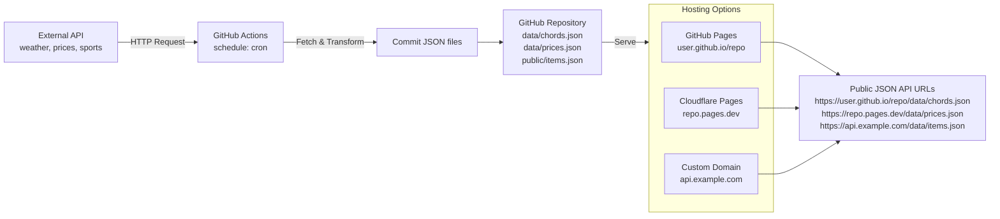
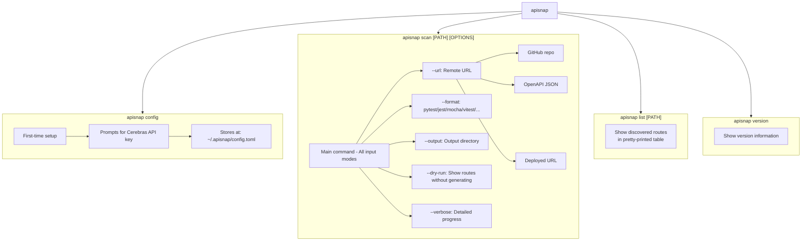
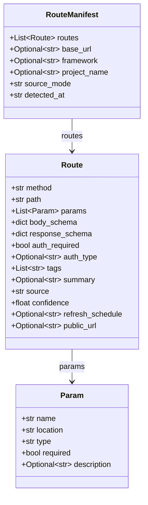

# apisnap

[](https://pypi.org/project/apisnap/)
[](https://pypi.org/project/apisnap/)
[](LICENSE)

AI-powered API test case generator. Point it at any codebase, URL, or GitHub repo and get instant runnable tests.

## What is apisnap?

apisnap is a CLI tool that automatically generates API test cases using AI. It discovers API endpoints from your project and generates comprehensive test cases in your preferred framework.

### Key Features

- **Auto-discovery**: Scans your codebase to find API endpoints automatically
- **Multi-format support**: Outputs tests in pytest, unittest, jest, mocha, vitest, and more
- **GitHub-as-database support**: Special support for repos that use GitHub as a serverless database
- **AI-powered**: Uses Cerebras AI to generate intelligent, comprehensive test cases

### The GitHub-as-Database Pattern

apisnap has special support for the increasingly popular "GitHub-as-database" serverless API pattern. This pattern works by:

1. A GitHub Actions workflow runs on a cron schedule
2. The workflow fetches data from an external API
3. The data is committed as JSON files to the repository
4. Those JSON files are served via GitHub Pages or Cloudflare Pages

This creates a completely free, serverless, zero-maintenance JSON API - and apisnap can generate tests for it automatically!

## Installation

```bash
# Recommended: use uvx (no install needed)
uvx apisnap scan --url https://github.com/user/repo

# Install with uv
uv add apisnap --dev

# Install with pip
pip install apisnap
```

## Quick Start

### 1. Configure your API key

```bash
apisnap config --api-key sk-your-key-here
```

### 2. Scan a GitHub repo (GitHub-as-database pattern)

```bash
apisnap scan --url https://github.com/user/guitar-chords-repo
```

### 3. Scan a local project

```bash
apisnap scan ./src
```

### 4. Scan an OpenAPI URL

```bash
apisnap scan --url https://api.example.com/openapi.json
```

### 5. Preview routes without generating tests

```bash
apisnap scan --url https://github.com/user/repo --dry-run
```

---

## Diagrams

### How apisnap works — system overview

```mermaid
flowchart TB
    subgraph Inputs["Input Modes"]
        M1[Local Code Scan]
        M2[OpenAPI URL]
        M3[JSON URL]
        M4[Deployed URL]
        M5[GitHub Repo]
    end

    M1 --> Detector
    M2 --> Detector
    M3 --> Detector
    M4 --> Detector
    M5 --> Detector

    Detector{Auto-Detector} --> Manifest[Route Manifest]

    Manifest --> AI[Ai Engine Cerebras]
    AI --> Writers[Test Writers]

    subgraph Writers["Test Writers"]
        W1[pytest]
        W2[unittest]
        W3[jest]
        W4[mocha]
        W5[vitest]
        W6[restassured]
        W7[rspec]
        W8[httpx]
    end

    Writers --> Output[Output Files]
    Output >|./tests/*.|Output
```

### The GitHub-as-database serverless API pattern



### How apisnap scans a GitHub-as-database repo

```mermaid
flowchart TB
    Input[Input: https://github.com/user/guitar-chords-repo] --> Step1[Step 1: Fetch Repo Tree<br/>GET /repos/{owner}/{repo}/git/trees?recursive=1]
    
    Step1 --> Step2[Step 2: Scan Generator Scripts<br/>.github/workflows/*.yml → parse<br/>scripts/*.py → extract cron, fetch URLs]
    
    Step2 --> Step2a[workflow: cron: 0 */6<br/>output: data/*.json]
    Step2 --> Step2b[scripts: fetch_chords.py<br/>from external API]
    
    Step2a --> Step3[Step 3: Find JSON Data Files<br/>data/*.json, public/*.json<br/>api/*.json, output/*.json]
    Step2b --> Step3
    
    Step3 --> Step4[Step 4: Infer Schema<br/>Analyzes JSON structure<br/>Infers types]
    
    Step4 --> Step5[Step 5: Detect Public URL<br/>CNAME → custom domain<br/>wrangler.toml → Cloudflare Pages<br/>docs/ → GitHub Pages]
    
    Step5 --> Step6[Step 6: Build RouteManifest<br/>method: GET, path: /data/chords.json<br/>public_url: https://...<br/>confidence: 0.95]
    
    Step6 --> Output[RouteManifest → Ai → Tests]
```

### apisnap CLI modes and commands


┌─────────────────────────────────────────────────────────────────────────────┐
│                          APISNAP CLI COMMANDS                               │
└─────────────────────────────────────────────────────────────────────────────┘

┌─────────────────────────────────────────────────────────────────────────────┐
│ apisnap config                                                              │
│                                                                             │
│ First-time setup. Prompts for and stores Cerebras API key.                 │
│ Stores config at: ~/.apisnap/config.toml                                    │
│                                                                             │
│ Options:                                                                    │
│   --api-key TEXT    Set Cerebras API key                                    │
│   --show            Show current configuration                             │
│   --format TEXT     Default test format                                    │
│   --output-dir TEXT Default output directory                               │
└─────────────────────────────────────────────────────────────────────────────┘

┌─────────────────────────────────────────────────────────────────────────────┐
│ apisnap scan [PATH] [OPTIONS]                                               │
│                                                                             │
│ Main command. All input modes:                                              │
│                                                                             │
│   PATH    Path to scan (default: current directory)                        │
│                                                                             │
│ Options:                                                                    │
│   --url TEXT          Remote URL (GitHub repo, OpenAPI JSON, deployed URL) │
│   --format TEXT       Test framework [pytest|jest|mocha|vitest|...]        │
│   --output TEXT       Output directory [default: ./tests]                  │
│   --framework TEXT    Force framework detection                            │
│   --mode TEXT         Force discovery mode [source|openapi|json|...]       │
│   --dry-run           Show routes without generating tests                 │
│   --base-url TEXT     Base URL for test requests                           │
│   --verbose           Detailed progress                                     │
│   --no-ai            Print manifest as JSON, skip test generation          │
└─────────────────────────────────────────────────────────────────────────────┘

┌─────────────────────────────────────────────────────────────────────────────┐
│ apisnap list [PATH]                                                        │
│                                                                             │
│ Show discovered routes in a pretty-printed table.                          │
└─────────────────────────────────────────────────────────────────────────────┘

┌─────────────────────────────────────────────────────────────────────────────┐
│ apisnap version                                                            │
│                                                                             │
│ Show version information.                                                  │
└─────────────────────────────────────────────────────────────────────────────┘
```

### AI test generation pipeline

```mermaid
flowchart TB
    Input[RouteManifest] --> Check{Confidence Check<br/>confidence >= 0.8?}
    
    Check -->|Yes| Pass1[Pass 1: Schema Refinement]
    Check -->|No| LowConf[Use with lower confidence]
    
    Pass1 --> Pass2[Pass 2: Test Generation]
    LowConf --> Pass2
    
    Pass2 --> BuildPrompt[Build prompt with:<br/>- Method, Path, URL<br/>- Auth requirements<br/>- Response schema<br/>- Source type<br/>- Framework target]
    
    BuildPrompt --> Ai[Cerebras Ai Api<br/>Model: gpt-oss-120b]
    
    Ai --> Prompt[Prompt: "Generate tests<br/>for category: happy path,<br/>auth failure, schema..."]
    
    Prompt --> Writer[Framework Writer<br/>pytest / unittest / jest<br/>mocha / vitest / rspec<br/>restassured / httpx]
    
    Writer --> Output[Test Files<br/>test_api_users.py<br/>test_api_products.py<br/>...]
```

### Internal route manifest structure



---

## Supported Frameworks

### Source Code Frameworks

| Framework | Detection Method | Example File |
|-----------|------------------|--------------|
| FastAPI | `@app.get`, `@router.post`, `APIRouter` | `main.py` |
| Flask | `Flask(`, `@app.route` | `app.py` |
| Django DRF | `settings.py`, `@api_view` | `views.py` |
| Express | `app.get`, `router.post`, `express` | `index.js` |
| Spring Boot | `@RestController`, `@GetMapping` | `Controller.java` |
| Gin | `gin.New()`, `r.GET`, `r.POST` | `main.go` |
| Rails | `config/routes.rb`, `resources :users` | `routes.rb` |

### Test Output Formats

| Format | Install Command | Language |
|--------|----------------|----------|
| pytest | `pip install requests pytest` | Python |
| unittest | Built-in | Python |
| httpx | `pip install httpx pytest-httpx` | Python |
| jest | `npm install jest axios` | JavaScript |
| mocha | `npm install mocha axios` | JavaScript |
| vitest | `npm install vitest axios` | TypeScript |
| restassured | Maven dependency | Java |
| rspec | `gem install rspec` | Ruby |

---

## GitHub-as-Database Repos — Detailed Guide

### What is this pattern?

The GitHub-as-database pattern is a way to create free, serverless JSON APIs using GitHub repositories. It's popular for:

- Public data that updates periodically (weather, prices, sports scores)
- Static datasets that need occasional updates
- Personal projects and side projects
- Prototyping and MVPs

### How it works

1. **Create a GitHub repository**
2. **Add a GitHub Actions workflow** that runs on a cron schedule
3. **The workflow fetches data** from an external API
4. **Commits the data** as JSON files to the repo
5. **Serve via GitHub Pages** or Cloudflare Pages

### Example Workflow

```yaml
name: Update Data

on:
  schedule:
    - cron: '0 */6 * * *'  # Every 6 hours

jobs:
  update:
    runs-on: ubuntu-latest
    steps:
      - uses: actions/checkout@v4
      - name: Fetch data
        run: python fetch_data.py
      - name: Commit changes
        uses: stefanzweifel/git-auto-commit-action@v5
        with:
          commit_message: "Update data"
          file_pattern: "data/*.json"
```

### What apisnap detects

When scanning a GitHub repo, apisnap:

1. **Finds workflow files** - Extracts cron schedules, fetch URLs, output paths
2. **Finds JSON data files** - In `/data/`, `/public/`, `/api/`, etc.
3. **Infers schemas** - Analyzes JSON structure to infer types
4. **Detects public URL** - GitHub Pages, Cloudflare Pages, or CNAME
5. **Generates tests** - Validates URL, schema, types, CORS, caching

---

## Configuration Reference

Config file location: `~/.apisnap/config.toml`

```toml
[cerebras]
api_key = "sk-xxxx"                    # Your Cerebras API key
model = "gpt-oss-120b"                 # AI model to use

[defaults]
output_dir = "./tests"                  # Default output directory
format = "pytest"                       # Default test framework
```

### Setting up the API key

```bash
# Interactive prompt
apisnap config

# Non-interactive
apisnap config --api-key sk-your-key-here

# Show current config
apisnap config --show
```

---

## Contributing

Contributions are welcome! Here's how to get started:

1. **Clone the repository**
   ```bash
   git clone https://github.com/chirag127/apisnap.git
   cd apisnap
   ```

2. **Install dependencies**
   ```bash
   pip install -e ".[dev]"
   ```

3. **Run tests**
   ```bash
   pytest tests/ -v
   ```

4. **Add a new scanner**
   - Create `src/apisnap/scanner/source/newframework_scanner.py`
   - Inherit from `BaseScanner`
   - Implement `scan()` and `can_handle()` methods

5. **Add a new writer**
   - Create `src/apisnap/writers/newformat_writer.py`
   - Inherit from `BaseWriter`
   - Implement `write()` and `write_file()` methods

---

## Publishing to PyPI

This package uses GitHub Actions for publishing to PyPI.

### Setup

1. Create a PyPI account at https://pypi.org/
2. Configure trusted publishing in PyPI:
   - Go to Project Settings → Publishing
   - Add a new publisher
   - Connect to GitHub
3. Configure GitHub environment:
   - Go to repo Settings → Environments
   - Create `pypi` environment
   - Add trusted publisher

### Publish a new version

```bash
# Update version in pyproject.toml
git commit -m "Bump version"
git tag v0.1.0
git push --tags
```

The GitHub Actions workflow will automatically publish to PyPI when you push a version tag.

---

## License

MIT License - see [LICENSE](LICENSE) for details.

---

## Links

- [GitHub Repository](https://github.com/chirag127/apisnap)
- [PyPI Package](https://pypi.org/project/apisnap/)
- [Issue Tracker](https://github.com/chirag127/apisnap/issues)