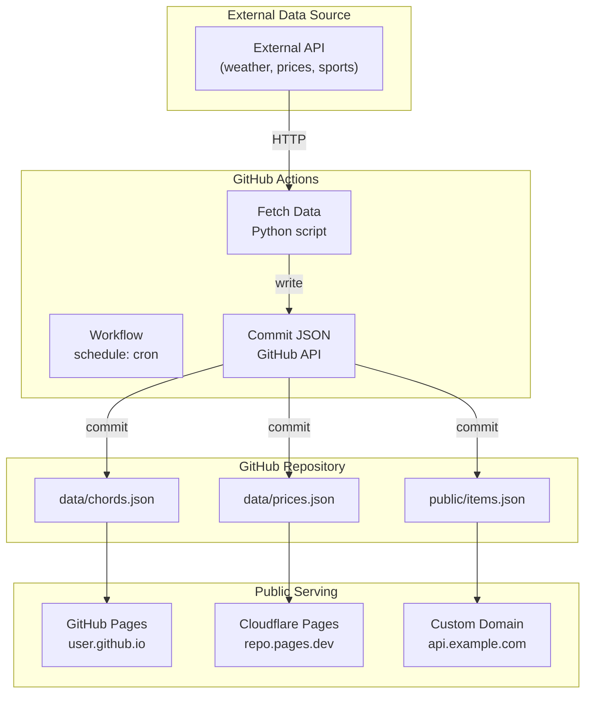

# The GitHub-as-Database Serverless API Pattern

This diagram explains the popular "GitHub-as-database" pattern that apisnap specially supports.

## Mermaid Diagram

## Explanation

The GitHub-as-database pattern creates free serverless APIs:

1. **External API** fetches data from any external source
2. **Cron-based workflow** runs on schedule (e.g., every 6 hours)
3. **Python/Node script** fetches and transforms data
4. **Commits JSON** files directly to the repository
5. **GitHub/Cloudflare Pages** serves the JSON publicly

This creates a zero-cost, zero-maintenance JSON API!

## apisnap Detection

When apisnap scans a GitHub repo, it:
- Finds workflow files → extracts cron schedule
- Finds JSON data files → infers schema
- Detects public URL → generates tests