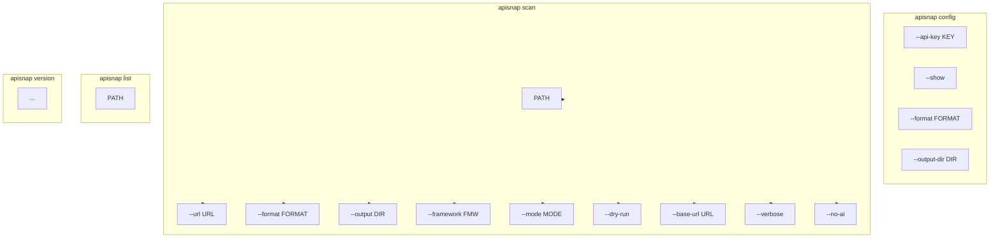

# CLI Modes Reference

This diagram shows all apisnap CLI commands and their options.

## Mermaid Diagram

## CLI Input Modes

| Mode | Command | Description |
|------|---------|-------------|
| Local | `apisnap scan ./src` | Scan local codebase |
| OpenAPI | `apisnap scan --url https://api.example.com/openapi.json` | Parse OpenAPI spec |
| JSON | `apisnap scan --url https://api.example.com/data.json` | Infer from JSON endpoint |
| Deployed | `apisnap scan --url https://myapp.pages.dev` | Crawl deployed app |
| GitHub | `apisnap scan --url https://github.com/user/repo` | Scan GitHub-as-database |

## Supported Frameworks

- **Source**: FastAPI, Flask, Django, Express, Spring, Gin, Rails
- **Output**: pytest, unittest, jest, mocha, vitest, restassured, rspec, httpx