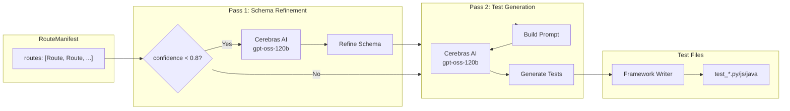

# AI Test Generation Pipeline

This diagram shows how apisnap uses AI to generate tests.

## Mermaid Diagram

## Two-Pass Strategy

1. **Pass 1 - Schema Refinement** (optional)
   - Triggered only if confidence < 0.8
   - Cleans up inferred schemas
   - Identifies precise field types

2. **Pass 2 - Test Generation** (always)
   - Uses cleaned schema
   - Generates 11 test categories per route:
     1. Happy path
     2. Schema validation
     3. Type validation
     4. Auth failure
     5. Wrong method (405)
     6. Empty response
     7. Content-Type check
     8. CORS headers
     9. Cache headers
     10. Boundary inputs
     11. 404 invalid

## Model Configuration

- Default model: `gpt-oss-120b`
- API: `https://api.cerebras.ai/v1`
- Temperature: 0.2 (tests), 0.1 (schema refinement)