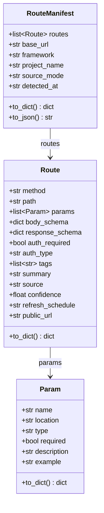

# Route Manifest Structure

This diagram shows the internal data structure used by apisnap.

## Mermaid Diagram

## Data Classes

### RouteManifest
Container for all discovered routes.

| Field | Type | Description |
|-------|------|-------------|
| routes | list[Route] | Discovered API routes |
| base_url | str | Base URL for requests |
| framework | str | Source framework |
| project_name | str | Project name |
| source_mode | str | Discovery mode |
| detected_at | str | Original input |

### Route
Represents a single API endpoint.

| Field | Type | Description |
|-------|------|-------------|
| method | str | HTTP method (GET, POST, etc.) |
| path | str | Endpoint path |
| params | list[Param] | Path/query parameters |
| body_schema | dict | Request body JSON schema |
| response_schema | dict | Response JSON schema |
| auth_required | bool | Is auth required? |
| auth_type | str | Auth type (bearer, api_key, etc.) |
| source | str | Discovery source |
| confidence | float | 0.0-1.0 confidence |
| refresh_schedule | str | Cron for GitHub-as-database |
| public_url | str | Full public URL |

### Param
Represents an API parameter.

| Field | Type | Description |
|-------|------|-------------|
| name | str | Parameter name |
| location | str | path, query, header, body |
| type | str | string, integer, boolean, etc. |
| required | bool | Is required? |
| description | str | Parameter description |
| example | str | Example value |