# Comprehensive Guide: AI-Powered API Test Generation with apisnap

## Production-Ready Asset for Teams and Organizations

This document serves as a complete, reusable reference guide for teams and organizations to leverage **apisnap** — an AI-powered CLI tool that automatically generates API test cases. It provides comprehensive coverage of the tool's architecture, workflows, code examples, and best practices for implementing automated API testing in any project.

---

## Table of Contents

1. [Introduction](#introduction)
2. [Architecture Overview](#architecture-overview)
3. [Installation](#installation)
4. [Configuration](#configuration)
5. [CLI Commands Reference](#cli-commands-reference)
6. [Scanning Modes](#scanning-modes)
7. [Code Examples](#code-examples)
8. [Mermaid Diagrams](#mermaid-diagrams)
9. [Internal Implementation](#internal-implementation)
10. [Test Frameworks Supported](#test-frameworks-supported)
11. [GitHub-as-Database Pattern](#github-as-database-pattern)
12. [Best Practices](#best-practices)
13. [Troubleshooting](#troubleshooting)
14. [Integration Guide](#integration-guide)
15. [CLI Command Reference](#cli-command-reference-1)

---

## Introduction

**apisnap** is an AI-powered CLI tool that automatically generates API test cases using Cerebras AI. It discovers API endpoints from multiple sources and produces high-quality, runnable test code in various frameworks.

### Key Capabilities

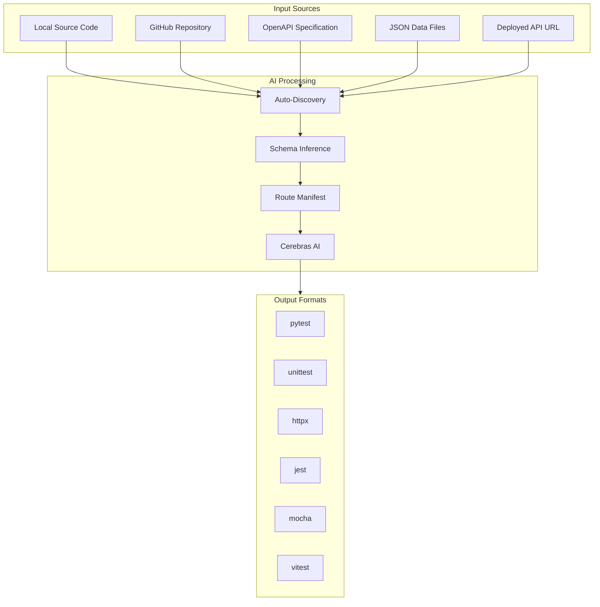

---

## Architecture Overview

### System Components

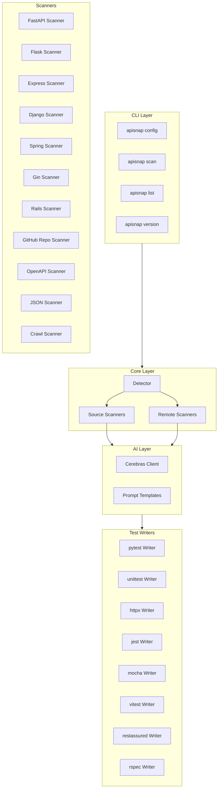

### Route Discovery Pipeline

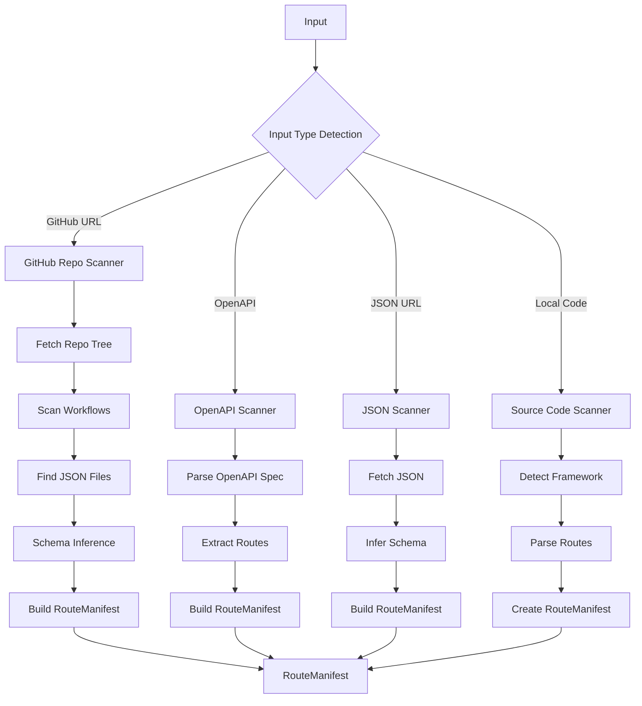

---

## Installation

### Recommended: uvx (No Installation)

```bash
# Use directly without installation
uvx apisnap scan --url https://github.com/user/repo
```

### Install with uv

```bash
# Add as dev dependency
uv add apisnap --dev

# Or install globally
uv pip install apisnap
```

### Install with pip

```bash
pip install apisnap
```

### Verify Installation

```bash
apisnap version
```

**Expected Output:**
```text
apisnap 0.1.0
```

---

## Configuration

### Initial Setup

Before generating tests, you must configure the Cerebras API key.

### Command: Set API Key

```bash
apisnap config --api-key YOUR_CEREBRAS_API_KEY
```
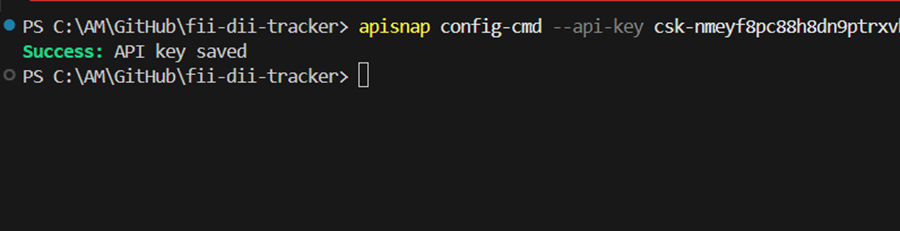

### Alternative: Interactive Configuration

```bash
# Runs interactive prompt
apisnap config
```

**Expected Output:**
```text
? Enter Cerebras API key: [hidden input]
? Default format (pytest) pytest
? Default output directory ./tests
Success: API key saved
```

### Show Current Configuration

```bash
apisnap config --show
```

**Expected Output:**
```text
Cerebras API Key: csk-xxxx...xxxx (first 8 chars shown)
Default Format: pytest
Default Output: ./tests
```

### Configuration File Location

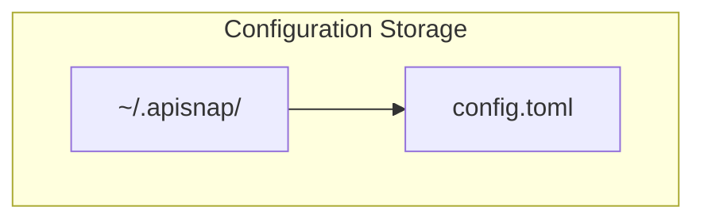

Config stored at: `~/.apisnap/config.toml`

```toml
# ~/.apisnap/config.toml
[cerebras]
api_key = "csk-xxxx"           # Your Cerebras API key
model = "qwen-3-235b-a22b-instruct-2507"

[defaults]
output_dir = "./tests"
format = "pytest"
```

---

## CLI Commands Reference

### Command: scan

The primary command for scanning and generating tests.

```bash
apisnap scan [PATH] [OPTIONS]
```

#### Options

| Option | Description | Example |
|--------|-------------|---------|
| `PATH` | Path to scan (default: current directory) | `./src` |
| `--url TEXT` | Remote URL (GitHub, OpenAPI, JSON) | `--url https://github.com/user/repo` |
| `--format TEXT` | Test framework | `--format pytest` |
| `--output TEXT` | Output directory | `--output ./tests` |
| `--framework TEXT` | Force framework detection | `--framework fastapi` |
| `--mode TEXT` | Force discovery mode | `--mode github` |
| `--dry-run` | Show routes only, no test generation | `--dry-run` |
| `--base-url TEXT` | Base URL for tests | `--base-url https://api.example.com` |
| `--verbose` | Detailed progress output | `--verbose` |
| `--no-ai` | Print manifest as JSON, skip AI | `--no-ai` |

### Command: config

Manage configuration.

```bash
apisnap config [OPTIONS]
```

| Option | Description |
|--------|-------------|
| `--api-key TEXT` | Set API key |
| `--show` | Show current config |
| `--format TEXT` | Set default format |
| `--output-dir TEXT` | Set default output dir |

### Command: list

List discovered routes.

```bash
apisnap list [PATH]
```

### Command: version

Show version.

```bash
apisnap version
```

---

## Scanning Modes

### Mode 1: GitHub Repository (GitHub-as-Database)

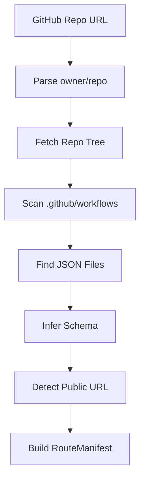

#### Command

```bash
apisnap scan --url https://github.com/owner/repo
```

**Real Example:**

```bash
apisnap scan --url https://github.com/chirag127/fii-dii-tracker
```

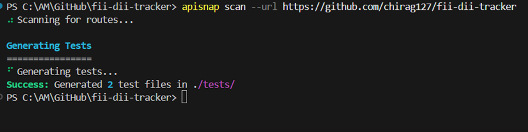


### Mode 2: Local Source Code

```bash
# Scan current directory
apisnap scan

# Scan specific directory
apisnap scan ./src

# Scan with framework hint
apisnap scan ./src --framework fastapi
```

Supported frameworks:
- FastAPI
- Flask
- Django REST Framework
- Express
- Spring Boot
- Gin (Go)
- Ruby on Rails

### Mode 3: OpenAPI Specification

```bash
# From URL
apisnap scan --url https://api.example.com/openapi.json

# From file
apisnap scan ./openapi.json
```

### Mode 4: JSON Data Files

```bash
# From URL
apisnap scan --url https://example.com/data.json

# With custom base URL
apisnap scan --url https://example.com/data.json --base-url https://api.example.com
```

### Mode 5: Dry Run (Preview Only)

```bash
# Preview routes without generating tests
apisnap scan --url https://github.com/user/repo --dry-run
```

**Expected Output:**
```text
Discovered Routes
================

Route: GET /data/chords.json
  URL: https://user.github.io/repo/data/chords.json
  Method: GET
  Auth: Not Required
  Confidence: 0.95

Route: GET /data/prices.json
  URL: https://user.github.io/repo/data/prices.json
  Method: GET
  Auth: Not Required
  Confidence: 0.95
```

---

## Code Examples

### Example 1: Full Workflow

#### Step 1: Configure API Key

```bash
# Set up your Cerebras API key
$ apisnap config --api-key csk-nmeyf8pc88h8dn9ptrxvhnr38xvrv8925ecf5t89hkn9deff

Success: API key saved
```

#### Step 2: Generate Tests

```bash
# Scan a GitHub repository
$ apisnap scan --url https://github.com/chirag127/fii-dii-tracker

⠴ Scanning for routes...

Generating Tests
================
⠋ Generating tests...
Success: Generated 2 test files in ./tests/
```

#### Step 3: Run Generated Tests

```bash
# Navigate to test directory
cd tests

# Run pytest
pytest -v
```

### Example 2: Using Different Frameworks

#### Generate jest Tests

```bash
apisnap scan --url https://github.com/user/repo --format jest
```

#### Generate mocha Tests

```bash
apisnap scan --url https://github.com/user/repo --format mocha
```

#### Generate vitest Tests

```bash
apisnap scan --url https://github.com/user/repo --format vitest
```

### Example 3: Custom Output Directory

```bash
apisnap scan --url https://github.com/user/repo --output ./my-tests
```

### Example 4: Verbose Mode

```bash
apisnap scan --url https://github.com/user/repo --verbose
```

**Expected Output:**
```text
Scanning: https://github.com/user/repo
Detected mode: github
Found 3 JSON files
Fetching: data/users.json
Fetching: data/products.json
Fetching: data/orders.json
Generating tests...
Writing: test_api_users.py
Writing: test_api_products.py
Writing: test_api_orders.py
Success: Generated 3 test files in ./tests/
```

### Example 5: Show Routes Only (Dry Run)

```bash
apisnap scan --url https://github.com/user/repo --dry-run
```

**Expected Output:**
```text
Discovered Routes
================

┌────────────────────────────────────────────────────────────────────────────┐
│ Method │ Path                    │ URL                          │ Conf  │
├────────┼─────────────────────────┼───────────────��───────────────┼───────┤
│ GET    │ /data/users.json        │ https://u.gi.io/repo/u.json    │ 0.95 │
│ GET    │ /data/products.json   │ https://u.gi.io/repo/p.json   │ 0.95 │
│ GET    │ /data/orders.json    │ https://u.gi.io/repo/o.json    │ 0.95 │
└────────────────────────────────────────────────────────────────────────────┘
```

### Example 6: Custom Base URL

```bash
apisnap scan --url https://github.com/user/repo --base-url https://api.example.com
```

### Example 7: No AI Mode (JSON Output)

```bash
apisnap scan --url https://github.com/user/repo --no-ai
```

**Expected Output:**
```json
{
  "routes": [
    {
      "method": "GET",
      "path": "/data/users.json",
      "public_url": "https://user.github.io/repo/data/users.json",
      "response_schema": {
        "type": "array",
        "items": {
          "type": "object",
          "properties": {
            "id": {"type": "integer"},
            "name": {"type": "string"}
          }
        }
      },
      "confidence": 0.95,
      "source": "github-data-repo"
    }
  ],
  "base_url": "https://user.github.io/repo",
  "framework": "github-data-repo",
  "project_name": "user/repo"
}
```

---

## Mermaid Diagrams

### Diagram 1: Complete System Architecture

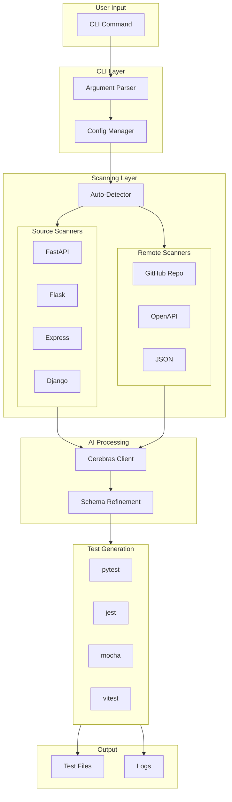

### Diagram 2: GitHub-as-Database Pattern

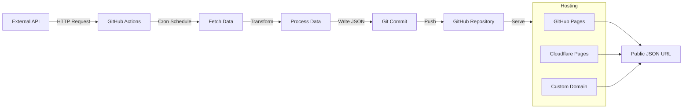

### Diagram 3: Route Discovery Flow

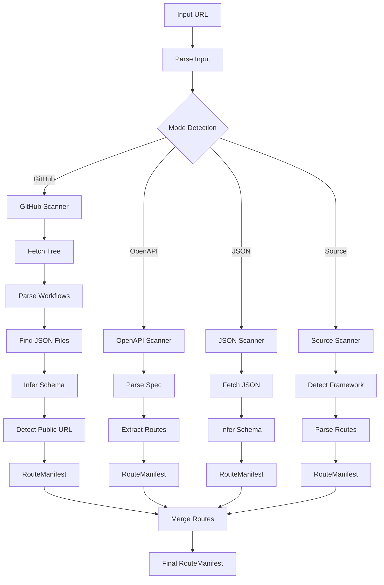

### Diagram 4: AI Test Generation Pipeline

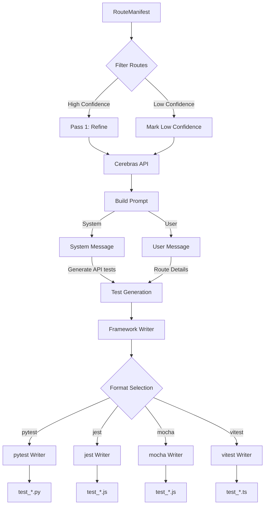

### Diagram 5: Test Categories Generated

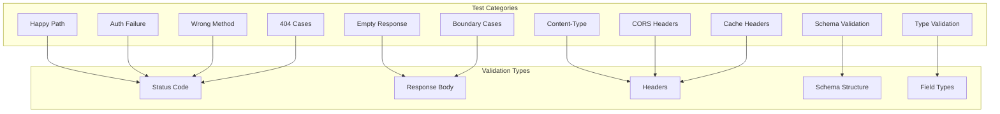

### Diagram 6: Data Flow Architecture

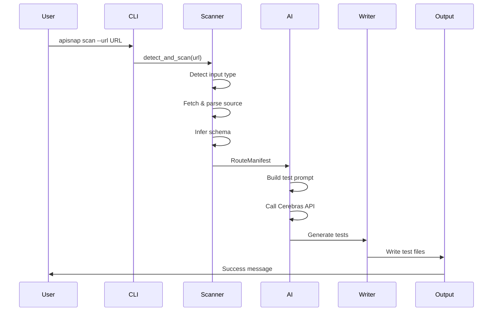

### Diagram 7: Configuration Flow

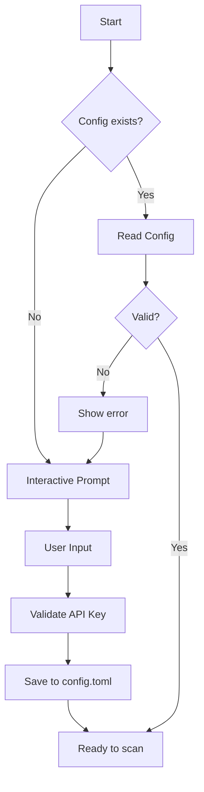

### Diagram 8: Error Handling Flow

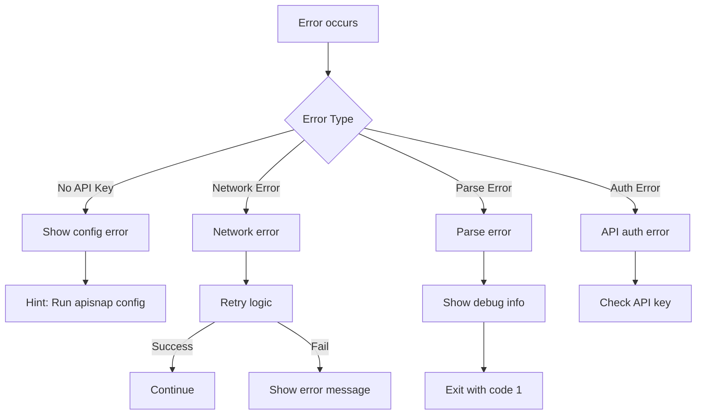

---

## Internal Implementation

### Core Data Structures

#### RouteManifest (schema.py)

```python
@dataclass
class RouteManifest:
    """Represents a collection of API routes."""

    routes: list[Route] = field(default_factory=list)
    base_url: Optional[str] = None
    framework: Optional[str] = None
    project_name: Optional[str] = None
    source_mode: str = "unknown"
    detected_at: str = ""

    def to_dict(self) -> dict[str, Any]:
        return {
            "routes": [r.to_dict() for r in self.routes],
            "base_url": self.base_url,
            "framework": self.framework,
            "project_name": self.project_name,
            "source_mode": self.source_mode,
            "detected_at": self.detected_at,
        }
```

#### Route (schema.py)

```python
@dataclass
class Route:
    """Represents an API route."""

    method: str  # GET, POST, PUT, DELETE, PATCH
    path: str    # /api/v1/users/{id}
    params: list[Param] = field(default_factory=list)
    body_schema: dict = field(default_factory=dict)
    response_schema: dict = field(default_factory=dict)
    auth_required: bool = False
    auth_type: Optional[str] = None  # "bearer", "api_key", "basic"
    tags: list[str] = field(default_factory=list)
    summary: Optional[str] = None
    source: str = "unknown"  # "openapi", "inferred", "github-data-repo"
    confidence: float = 1.0  # 0.0 to 1.0
    refresh_schedule: Optional[str] = None  # cron expression
    public_url: Optional[str] = None  # full public URL
```

#### Param (schema.py)

```python
@dataclass
class Param:
    """Represents an API parameter."""

    name: str
    location: str  # "path", "query", "header", "body"
    type: str       # "string", "integer", "boolean", "object", "array"
    required: bool
    description: Optional[str] = None
    example: Optional[str] = None
```

### GitHub Repository Scanner (github_repo_scanner.py)

```python
class GitHubRepoScanner(BaseScanner):
    """Scanner for GitHub repos that use GitHub as a database."""

    GITHUB_API_BASE = "https://api.github.com"
    GITHUB_RAW_BASE = "https://raw.githubusercontent.com"

    JSON_FILE_PATTERNS = [
        "data/", "public/", "api/", "dist/",
        "output/", "assets/", "_data/", "json/", ""
    ]

    GENERATOR_PATTERNS = [
        ".github/workflows/", "scripts/",
        "fetch_", "update_", "sync_"
    ]

    def scan(self, url: str, **kwargs) -> RouteManifest:
        """Scan GitHub repository for JSON data files."""
        # 1. Parse owner/repo
        owner, repo = self._parse_github_url(url)

        # 2. Fetch repo tree
        tree = self._fetch_repo_tree(owner, repo)

        # 3. Parse workflows
        workflow_info = self._parse_workflows(owner, repo, tree)

        # 4. Find JSON files
        json_files = self._find_json_data_files(tree)

        # 5. Detect public URL
        base_url = self._detect_public_url(owner, repo, tree)

        # 6. Build routes
        routes = []
        for json_path in json_files:
            route = self._build_route(json_path, content, base_url)
            routes.append(route)

        return RouteManifest(routes=routes, base_url=base_url, ...)
```

### AI Client (client.py)

```python
class CerebrasClient:
    """Client for Cerebras AI API."""

    CEREBRAS_BASE_URL = "https://api.cerebras.ai/v1"
    DEFAULT_MODEL = "qwen-3-235b-a22b-instruct-2507"

    def generate_tests(self, route: Route, framework: str) -> str:
        """Generate tests for a route using Cerebras AI."""
        prompt = get_generate_tests_prompt(route, framework)

        response = self.client.chat.completions.create(
            model=self.model,
            messages=[
                {"role": "system", "content": "You are an API test engineer."},
                {"role": "user", "content": prompt},
            ],
            temperature=0.2,
            max_tokens=4000,
        )

        return response.choices[0].message.content
```

### Test Generation Prompts (prompts.py)

```python
def get_generate_tests_prompt(route: Route, framework: str) -> str:
    """Generate comprehensive test prompt."""

    prompt = f"""Generate complete, runnable test code in {framework}
    for the following API endpoint.

    Endpoint details:
    - Method: {route.method}
    - Path: {route.path}
    - Public URL: {route.public_url}
    - Auth required: {route.auth_required}
    - Response schema: {route.response_schema}

    Generate tests for ALL categories:
    1. Happy path (200 response)
    2. Schema field presence
    3. Field type validation
    4. Auth failure tests
    5. Wrong HTTP method (405)
    6. Empty/null response
    7. Content-Type check
    8. CORS headers
    9. Cache headers
    10. Boundary inputs
    11. 404 variations

    Rules:
    - Write complete, runnable code
    - No placeholders, no pseudocode
    - Each test needs clear name"""

    return prompt
```

---

## Test Frameworks Supported

### Python Frameworks

| Framework | Command | Install | Use Case |
|-----------|---------|---------|----------|
| pytest | `--format pytest` | `pip install requests pytest` | API testing |
| unittest | `--format unittest` | Built-in | Built-in testing |
| httpx | `--format httpx` | `pip install httpx pytest-httpx` | Async testing |

### JavaScript Frameworks

| Framework | Command | Install | Use Case |
|-----------|---------|---------|----------|
| jest | `--format jest` | `npm install jest axios` | Unit/Integration |
| mocha | `--format mocha` | `npm install mocha axios` | BDD testing |
| vitest | `--format vitest` | `npm install vitest axios` | Vite-compatible |

### Other Frameworks

| Framework | Command | Language |
|-----------|---------|----------|
| restassured | `--format restassured` | Java |
| rspec | `--format rspec` | Ruby |

### Framework Detection

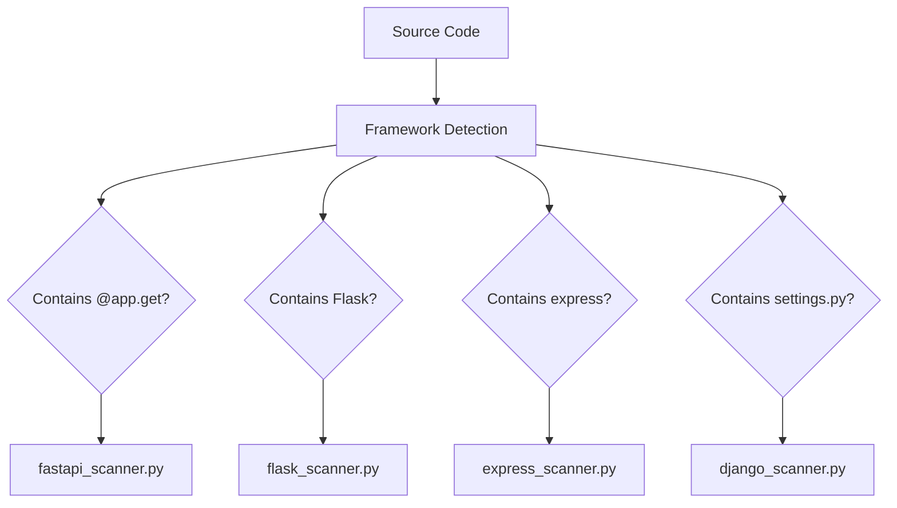

---

## GitHub-as-Database Pattern

### What is It?

The GitHub-as-Database pattern creates free, serverless JSON APIs using GitHub repositories for periodic data updates.

### How It Works

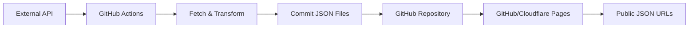

### Use Cases

- Weather data updates
- Stock/crypto prices
- Sports scores
- Currency exchange rates
- IoT sensor data
- Periodic reports

### Example Workflow

```yaml
name: Update Data

on:
  schedule:
    - cron: '0 */6 * * *'  # Every 6 hours

jobs:
  update:
    runs-on: ubuntu-latest
    steps:
      - uses: actions/checkout@v4
      - name: Fetch data
        run: python fetch_prices.py
      - name: Commit
        uses: stefanzweifel/git-auto-commit-action@v5
        with:
          commit_message: "Update prices"
          file_pattern: "data/*.json"
```

### What apisnap Detects

1. **Workflow schedules** - cron expressions
2. **Data source URLs** - external API calls
3. **Output file patterns** - data/*.json
4. **Serving URLs** - GitHub Pages, Cloudflare Pages
5. **Data schemas** - JSON structure analysis

---

## Best Practices

### 1. API Key Management

```bash
# Set API key (non-interactive)
apisnap config --api-key $CEREBRAS_API_KEY

# Or use environment variable
export CEREBRAS_API_KEY="csk-xxxx"
apisnap config --api-key $CEREBRAS_API_KEY
```

### 2. Output Organization

```bash
# Use separate test directories per project
apisnap scan --url REPO --output ./tests/REPO
```

### 3. Framework Selection

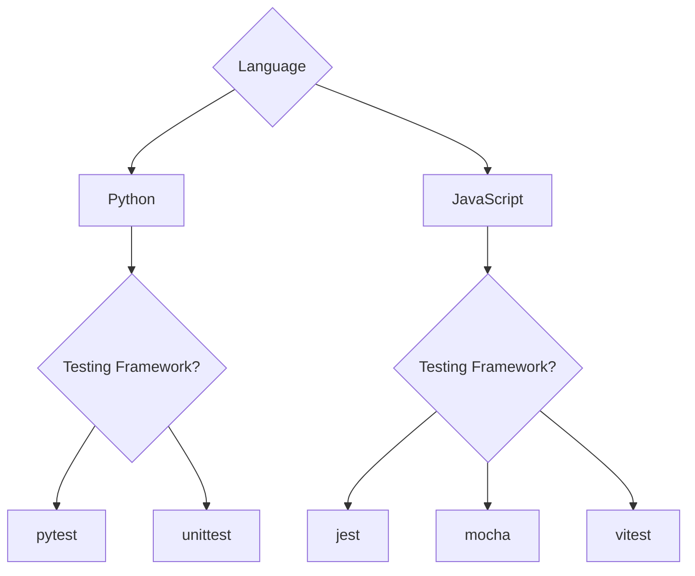

### 4. CI/CD Integration

```yaml
# .github/workflows/test-generation.yml
name: Generate API Tests

on:
  push:
    branches: [main]
  schedule:
    - cron: '0 0 * * *'  # Daily

jobs:
  generate-tests:
    runs-on: ubuntu-latest
    steps:
      - uses: actions/checkout@v4
      - uses: astral-sh/uv/setup-python@v1

      - name: Set API key
        run: apisnap config --api-key ${{ secrets.CEREBRAS_API_KEY }}

      - name: Generate tests
        run: apisnap scan --url ${{ github.repository }} --format pytest

      - name: Run tests
        run: pytest -v

      - name: Commit tests
        if: always()
        uses: stefanzweifel/git-auto-commit-action@v5
        with:
          commit_message: "Update API tests"
```

### 5. Handling Errors

```bash
# Enable verbose for debugging
apisnap scan --url REPO --verbose

# Check routes without generating
apisnap scan --url REPO --dry-run

# Skip AI for quick preview
apisnap scan --url REPO --no-ai
```

---

## Troubleshooting

### Common Issues

| Issue | Solution |
|------|---------|
| No API key | Run `apisnap config --api-key <key>` |
| Network error | Check connection, try verbose mode |
| No routes found | Verify the repo has JSON files in data/, public/ |
| Low confidence | Manually review generated tests |
| Wrong framework | Use `--framework` flag to force |

### Error Messages

```
# No API key
Error: No API key configured. Run 'apisnap config' first.

# Network error
Error: Failed to scan: Connection refused

# Parse error
Error: Failed to parse OpenAPI spec
```

---

## Integration Guide

### Integration with Existing Projects

```bash
# 1. Add apisnap to project
uv add apisnap --dev

# 2. Generate initial tests
apisnap scan ./src --output ./tests/generated

# 3. Review generated tests
ls tests/generated/

# 4. Run tests
pytest tests/generated/ -v

# 5. Add to version control
git add tests/generated/
git commit -m "Add generated API tests"
```

### GitHub Actions Integration

```yaml
name: API Tests

on:
  push:
    paths:
      - 'src/**'
  workflow_dispatch:

jobs:
  api-tests:
    runs-on: ubuntu-latest
    steps:
      - uses: actions/checkout@v4

      - name: Generate tests
        run: |
          apisnap config --api-key ${{ secrets.CEREBRAS_API_KEY }}
          apisnap scan --url ${{ github.repository }} --format pytest

      - name: Run tests
        run: pytest -v --junitxml=report.xml

      - name: Upload results
        uses: actions/upload-artifact@v4
        if: always()
        with:
          name: test-results
          path: report.xml
```

### Custom Test Framework Integration

To add a new test framework:

1. Create writer in `src/apisnap/writers/<framework>_writer.py`

```python
from apisnap.writers.base_writer import BaseWriter

class CustomWriter(BaseWriter):
    def write(self, manifest: RouteManifest, output: str) -> list[str]:
        """Generate tests in custom framework."""
        # Implementation
        pass
```

2. Register in `src/apisnap/writers/__init__.py`

---

## CLI Command Reference

### Quick Reference

```bash
# Configuration
apisnap config --api-key <key>          # Set API key
apisnap config --show                   # Show config
apisnap config --format pytest          # Set default format

# Scanning
apisnap scan <path>                   # Scan local
apisnap scan --url <url>               # Scan remote
apisnap scan --dry-run                 # Preview only
apisnap scan --no-ai                   # Skip AI

# Output
apisnap scan --format <framework>       # Specify format
apisnap scan --output <dir>           # Output directory
apisnap scan --verbose                # Verbose

# Other
apisnap list                          # List routes
apisnap version                      # Show version
```

---

## Additional Resources

- [PyPI Package](https://pypi.org/project/apisnap/)
- [Cerebras AI](https://cerebras.ai/)
- [GitHub Actions Documentation](https://docs.github.com/en/actions)
- [Cloudflare Pages](https://pages.cloudflare.com/)

---

*Document Version: 1.0*
*Last Updated: April 2026*
*Author: Chirag*