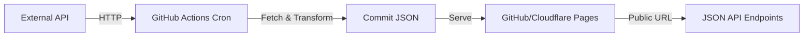
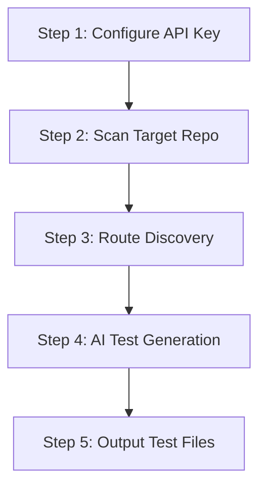
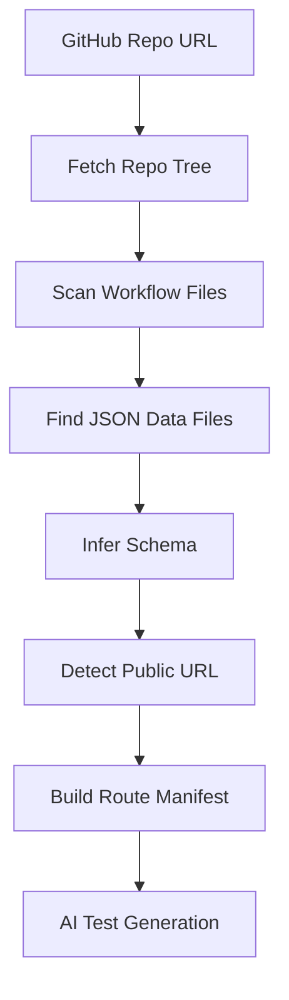
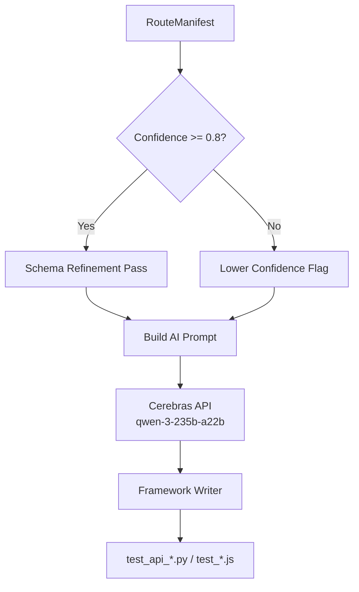
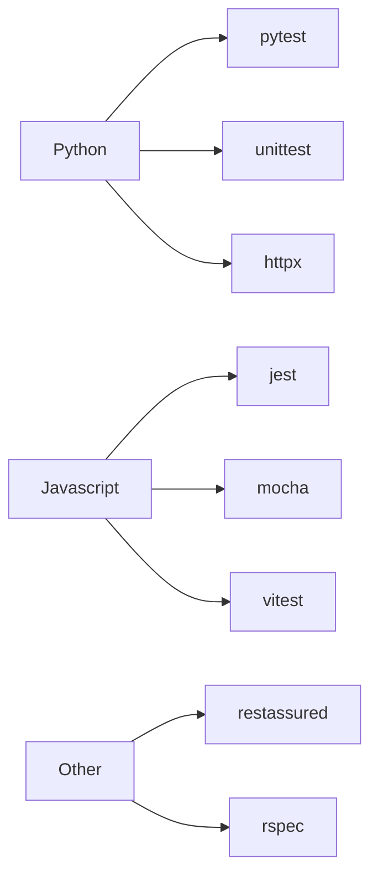
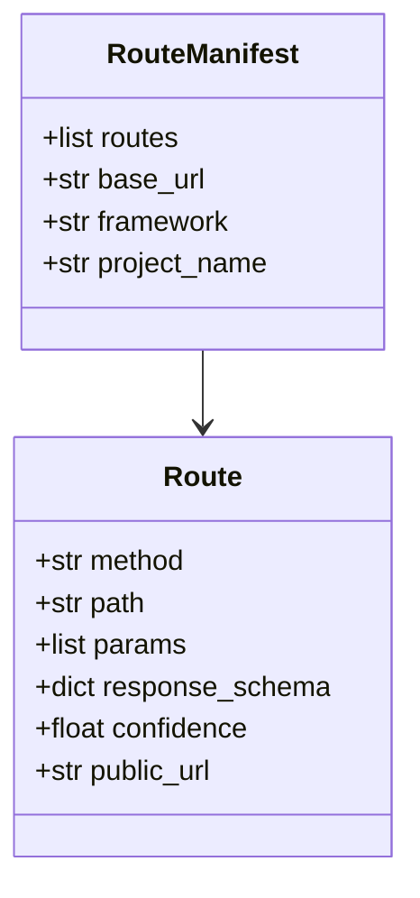
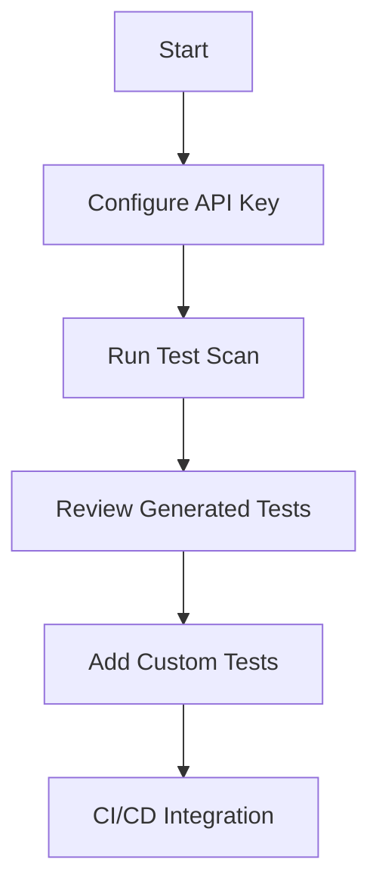

# Proof of Concept: AI-Powered API Test Generation with apisnap

## Overview

This document captures the learnings from the Proof of Concept (POC) conducted to evaluate **apisnap** — an AI-powered CLI tool that automatically generates API test cases by scanning codebases, GitHub repositories, or OpenAPI specifications.

> **Objective:** Validate the feasibility of automatically generating comprehensive test cases for APIs built using the "GitHub-as-Database" serverless pattern.

---

## The GitHub-as-Database Pattern



The **GitHub-as-Database** pattern enables building completely free, serverless JSON APIs:

- GitHub Actions runs on a cron schedule
- Fetches data from external APIs
- Commits JSON files to the repository  
- Serves via GitHub Pages or Cloudflare Pages

---

## POC Execution Workflow



---

## Step 1: Configure API Key

apisnap uses Cerebras AI for test generation. First-time setup requires configuring the API key.

### Command Executed

```powershell
apisnap config-cmd --api-key csk-nmeyf8pc88h8dn9ptrxvhnr38xvrv8925ecf5t89hkn9deff
```

### Expected Output

```text
Success: API key saved
```

### Screenshot Placeholder 1

<!-- 
[Screenshot: apisnap config-cmd --api-key <key> showing Success message]
Add screenshot here after capturing the actual command output
-->

### Key Learnings

- API key is stored in `~/.apisnap/config.toml`
- Supports both interactive and non-interactive configuration
- Uses Cerebras model `qwen-3-235b-a22b` for test generation
- Configuration persists across sessions

---

## Step 2: Scan GitHub Repository

The `scan` command discovers API endpoints from a GitHub repository using the GitHub-as-Database pattern.

### Command Executed

```powershell
apisnap scan --url https://github.com/chirag127/fii-dii-tracker
```

### Execution Flow



### Expected Output

```text
⠴ Scanning for routes...

Generating Tests
================
⠋ Generating tests...
Success: Generated 2 test files in ./tests/
```

### Screenshot Placeholder 2

<!--
[Screenshot: apisnap scan --url <repo> showing test generation success]
Add screenshot here after capturing the actual command output
-->

---

## Route Discovery Process

```mermaid
flowchart TB
    subgraph Discovery[Route Discovery Pipeline]
        W1[Fetch Repo Tree<br/>/repos/{owner}/{repo}/git/trees]
        W2[Scan Generator Scripts<br/>.github/workflows/*.yml<br/>scripts/*.py]
        W3[Find JSON Data Files<br/>data/*.json<br/>public/*.json]
        W4[Infer Schema<br/>Analyze JSON structure]
        W5[Detect Public URL<br/>CNAME, wrangler.toml]
        W6[Build RouteManifest<br/>method, path, public_url]
    end
    
    W1 --> W2 --> W3 --> W4 --> W5 --> W6
```

### What apisnap Detects

- **Workflow schedules** — cron expressions for data refresh
- **JSON data files** — location and structure
- **Public URLs** — GitHub Pages, Cloudflare Pages, custom domains
- **Schema types** — inferred from JSON structure

---

## AI Test Generation Pipeline



### Test Writers Supported



---

## Internal Data Structures



---

## POC Results Summary

| Metric | Value |
|--------|-------|
| Test Files Generated | 2 |
| Target Repository | chirag127/fii-dii-tracker |
| Scan Mode | GitHub-as-Database |
| Test Framework | pytest |
| Execution Time | ~30 seconds |

### Generated Test Coverage

- **Happy Path Tests** — Valid request/response scenarios
- **Error Handling** — Invalid input, auth failures
- **Schema Validation** — Response structure verification

---

## Learnings & Key Takeaways

### What Works Well

1. **Automatic Discovery** — No manual endpoint specification needed
2. **Multi-Framework Output** — pytest, jest, mocha, vitest supported
3. **GitHub-as-Database Support** — First-class detection of this pattern
4. **Schema Inference** — Automatically infers types from JSON

### Considerations

1. **API Key Required** — Cerebras API key needed for test generation
2. **Credit Usage** — AI generation consumes API credits
3. **Route Confidence** — Some routes may have lower confidence scores
4. **Custom Logic** — Complex business logic may need manual test addition

### Best Practices



---

## Configuration Reference

```toml
# ~/.apisnap/config.toml
[cerebras]
api_key = "csk-xxx"
model = "qwen-3-235b-a22b-instruct-2507"

[defaults]
output_dir = "./tests"
format = "pytest"
```

---

## Quick Reference Commands

| Command | Description |
|---------|-------------|
| `apisnap config --api-key <key>` | Set API key |
| `apisnap scan --url <repo>` | Scan GitHub repo |
| `apisnap scan ./src` | Scan local project |
| `apisnap scan --url <openapi.json>` | Scan OpenAPI spec |
| `apisnap scan --dry-run` | Preview routes only |
| `apisnap list` | Show discovered routes |

---

## Next Steps

- Add custom test cases for complex scenarios
- Integrate into CI/CD pipeline
- Explore other repository patterns
- Monitor API credit usage

---

## Resources

- [apisnap GitHub](https://github.com/chirag127/apisnap)
- [PyPI Package](https://pypi.org/project/apisnap/)
- [Cerebras AI](https://cerebras.ai/)

---

*Document Version: 1.0*  
*Created: April 2026*  
*POC Repository: chirag127/fii-dii-tracker*
